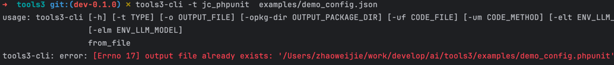

```shell
1. 安装工具
2. 通过json config 生成 phpunit 测试用例
3. 运行 phpunit 测试用例
4. 安装 allure 工具
5. 运行 allure 测试报告
```
## 1. 安装 tools3工具
```shell
pip install tools3
```

## 2. 使用 tools3 工具
```shell
tools3-cli -h
```

### tools工具帮助手册
```text
usage: tools3-cli [-h] [-t TYPE] [-o OUTPUT_FILE]
                  [-opkg-dir OUTPUT_PACKAGE_DIR] [-uf CODE_FILE]
                  [-um CODE_METHOD] [-elt ENV_LLM_TYPE] [-elk ENV_LLM_KEY]
                  [-elurl ENV_LLM_BASE_URL] [-elm ENV_LLM_MODEL]
                  from_file

compile unit tool

positional arguments:
  from_file             from file

options:
  -h, --help            show this help message and exit
  -t TYPE, --type TYPE  compile type (default: jc_phpunit)
                        Available options:  
                        - jc_py: Compile Python file from JSON config  
                        - jc_uc: Compile use case (UC) file from JSON config  
                        - al_uc: Compile use case (UC) file from php code  
                        - py_uc: Compile use case (UC) file from Python config  
                        - uc_phpunit: Compile PHPUnit file for use case (UC)
                        
                        Business scenarios: 
                        - jc_phpunit: Compile Json config file for PHPUnit
                                
  -o OUTPUT_FILE, --output-file OUTPUT_FILE
                        output file
  -opkg-dir OUTPUT_PACKAGE_DIR, --output-package-dir OUTPUT_PACKAGE_DIR
                        output package dir
  -uf CODE_FILE, --code-file CODE_FILE
                        Source code file for unit test generation.
  -um CODE_METHOD, --code-method CODE_METHOD
                        Method in the source file for unit test generation.
  -elt ENV_LLM_TYPE, --env-llm-type ENV_LLM_TYPE
                        large language model type.(default: openai)
                        Available options:  
                        - openai: OpenAI API
  -elk ENV_LLM_KEY, --env-llm-key ENV_LLM_KEY
                        OpenAI API key.
  -elurl ENV_LLM_BASE_URL, --env-llm-base-url ENV_LLM_BASE_URL
                        OpenAI API base url.
  -elm ENV_LLM_MODEL, --env-llm-model ENV_LLM_MODEL
                        OpenAI API model.

Copyright (c) 2025, tools3

```


## 3. 通过json config 生成 phpunit 测试用例
> 1. 创建一个json config文件，例如：examples/demo_config.json
```json
{
  "params": {
    "can_use_integral": {
      "values": {
        "积分_null": null,
        "积分_空字符串": "",
        "积分_数字零": "0",
        "积分_是": "1",
        "积分_否": "2"
      }
    }
  },
  "expected": {
    "hasException": false,
    "code": [422, 500]
  }
}
```
> 2. 生成phpunit
```shell
# 会在examples目录生成 demo_config.phpunit 文件
# examples/demo_config.phpunit
tools3-cli -t jc_phpunit  examples/demo_config.json

# 使用deepseek生成phpunit
tools3-cli -t jc_phpunit -lt deepseek -lurl=https://api.deepseek.com -lk=sk-05e8317ce08641c684108e5012c560ec -lm=deepseek-chat -uf=/Users/zhaoweijie/work/develop/company/docker-compose-nginx-php/dhb168-local-docker/www/pc-dhb168/Dinghuobao/DhbApi/Controller/Admin/AdminCartController.class.php -um=add   examples/demo_config.json

# 使用deepseek生成phpunit 到指定文件
tools3-cli -t jc_phpunit -php=/usr/local/Cellar/php@7.3/7.3.33_11/bin/php -lt deepseek -lurl=https://api.deepseek.com -lk=sk-05e8317ce08641c684108e5012c560ec -lm=deepseek-chat -uf=/Users/zhaoweijie/work/develop/company/docker-compose-nginx-php/dhb168-local-docker/www/pc-dhb168/Dinghuobao/DhbApi/Controller/Admin/AdminCartController.class.php -um=add -o demo_config.php  examples/demo_config.json
# 当前目录下生成单元测试文件 demo_config.php
```
